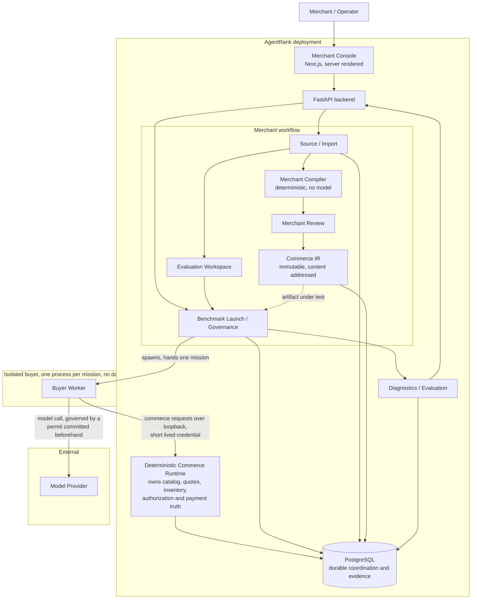

# AgentRank

AgentRank measures whether AI buyer agents can actually transact with a merchant, identifies why
they fail, compiles ordinary merchant catalogs and policies into a structured machine-readable
commerce representation, and reruns the identical benchmark to measure what changed.

## The problem

Merchants publish for humans. A storefront states a charger's wattage in a paragraph, puts the
colour in a variant label, and leaves the return window on a different page. A person reads around
all of that. An AI buyer acting on someone's behalf has to decide, from what is published, whether
a product meets a hard requirement, and it has to be right, because the next thing it does is spend
money.

When it cannot decide, it does one of two things: it abstains from a purchase the merchant could
have served, or it buys the wrong thing. The first is invisible to the merchant. The second is
worse. Neither shows up in any analytics a merchant currently has, and neither has a name.

AgentRank gives it a name and a number, then gives the merchant something to do about it.

## What it does

```text
1  Import      the merchant's own public pages become a frozen source snapshot
2  Evaluate    a benchmark generated from that snapshot measures whether a buyer can transact
3  Compile     the Merchant Compiler turns the snapshot into agent-ready Commerce IR
4  Review      the merchant confirms or rejects every candidate fact
5  Publish     the confirmed representation becomes an immutable artifact
6  Re-evaluate the identical suite runs against it, and the two runs are compared
```

Every step is a separate command. Nothing chains: publishing spends nothing and measures nothing,
and launching an evaluation spends model quota and takes as long as a suite takes, so neither
happens as a side effect of the other.

## The merchant workflow

An operator provisions a merchant and issues them one API key. There is no public signup. That is
the whole of what happens before a merchant can sign in, and everything after it is the merchant's
own.

The merchant signs into the console with their key and gives AgentRank a list of their own public
product pages. AgentRank fetches them, reads them deterministically, and shows the merchant exactly
what it read, including what it could not find. Nothing becomes source history until the merchant
confirms it. What they confirm is a frozen, content-addressed snapshot.

From that snapshot AgentRank bootstraps an **evaluation workspace**: an isolated benchmark world
built from the merchant's own catalog, and a suite of missions generated from it whose expected
outcomes are computed from that same frozen data rather than authored by hand.

The merchant launches their first evaluation. It is admitted as a queued row and executed by a
separate dispatcher process, one worker process per mission, against the ordinary storefront
discovery surface. The result says which missions a buyer completed, which it abstained from, which
it got wrong, and why each one failed.

Then they compile. The Merchant Compiler reads the same frozen snapshot and proposes candidate
facts, each traceable to the source field it came from. The merchant reviews them. Confirmed
candidates become a published Commerce IR representation, immutable and identified by content.

Finally they re-evaluate. The identical suite runs again, this time with the published
representation as the buyer's discovery surface, and the two runs are compared: which missions
changed outcome, in which direction, and which caveats have to travel with that statement.

## Trust model

The load-bearing rule is that **no model authorizes a financial action**.

A buyer agent can request a quote and attempt a payment. Whether either is permitted is decided by
deterministic code reading the merchant's own rows, through two independent gates: whether the
money is within the mandate that authorized it, and whether the thing being bought satisfies the
buyer's hard constraints. Both must pass. A missing constraint set is a denial, never a default.

A buyer also cannot mark its own work. It runs in its own process with no database, no settings, no
suite, no expected outcome, and an allowlisted environment. Its report carries identifiers and
actions and nothing else: no status, no failure reason, no price, no authorization decision. What
those identifiers came to is established afterwards from the merchant's own rows, and payments are
swept rather than reported, so a buyer that hides a purchase is found anyway.

The compiler does not own commerce truth either. It is deterministic, runs no model, and infers
nothing; every compiled fact traces to a source field the merchant stated and confirmed. A published
representation is a discovery surface. It cannot move a price, a stock level or a quote total.

Merchant isolation is structural rather than filtered: commerce tables use composite foreign keys
carrying the merchant identifier, so one merchant's row cannot reference another's whatever a caller
passes, and another merchant's identifier is answered identically to one that does not exist.

There is no live payment mode. Razorpay is Test Mode only, refused structurally at startup if the
key is not a test key, with no flag that relaxes it.

[SECURITY.md](SECURITY.md) describes each boundary, including where one is narrower than its name.

## Architecture

A modular monolith over PostgreSQL, with separate processes only where a process boundary buys
something specific.



The boundaries that matter: the buyer worker is a separate process with no database and no access
to any expected outcome; the model provider is external and every call is charged against a permit
committed before the process starts; PostgreSQL holds all durable coordination and the entire
evidence record; the deterministic commerce runtime is the only thing that decides commerce and
financial truth; and the compiler produces a discovery surface, never a financial fact.

[docs/architecture.md](docs/architecture.md) covers each component and the known limitations.

## Benchmark methodology

A mission is a pair of separate types: a brief holding everything the buyer may see, and an oracle
holding what the evaluator knows and the buyer must not. Suites are content-addressed and immutable,
and a run pins the suite, the world, the executor and its revision, the catalog, the evaluator
version and the representation identity, so two runs whose pins differ were measuring different
things.

Six things are true of every number this system produces, and each is enforced in code rather than
by care:

- **Simulated demand is simulated.** Authored buyer demand attached to missions. No money moves in a
  benchmark run. It is never revenue, never a forecast, and never a measured business result, and it
  is reported per currency and never summed across currencies.
- **Model claims never authorize financial actions.** A buyer's account of what it selected or
  whether it was allowed is a claim. Every financial decision is made by deterministic code reading
  the merchant's own rows.
- **Reference execution is not AI performance.** The deterministic reference executor has no model,
  no prompt and no language understanding, and reads structured fields a real storefront does not
  publish. Its completion rate is evidence that the benchmark path works and nothing else. Every
  report carries that disclaimer.
- **Generated merchant suites are not industry benchmarks.** A suite generated from one merchant's
  catalog measures that merchant. Two merchants' numbers are not comparable to each other.
- **There is no weighted AgentRank score.** No headline number exists and there is nowhere in the
  code to put one. Weights chosen before there are outputs to define them against would be invented
  rather than learned. What is published is raw counts, the ratios they support, and simulated demand
  by currency.
- **Non-interpretable evaluations stay non-interpretable.** When methodology evidence rules out
  causal reading, the conclusion is `NOT_INTERPRETABLE` and the metrics below it are marked
  descriptive only. Matching numbers do not rescue it and no later reading upgrades it.

A comparison that finds nothing is a result. `PARITY` means compilation did not help here, at this
sample size, for this model and this catalog, and it is publishable as such.

[docs/methodology.md](docs/methodology.md) is the full account.

## Limitations

- **No account model.** One merchant API key is one identity. Two people sharing a key are
  indistinguishable. There are no roles and no permissions.
- **No authenticated operator.** Provisioning merchants, issuing credentials and resolving stranded
  payments are command line operations, and nothing authenticates the person running them. The
  argument that makes that acceptable is that running them requires being able to run this
  repository's code against its database, and it holds only while that surface is local.
- **No live payments.** Only a deterministic fake provider and Razorpay Test Mode exist. The
  Razorpay bridge has been verified end to end against a transport fake and a signature digest
  computed outside this codebase, but has not yet been run against real Razorpay Test Mode keys.
- **In-process isolation is weaker than the process boundary.** The deterministic reference executor
  runs in process and can reach a session through two private attributes. Python offers no
  arrangement of private names that would change that. The out-of-process worker is the real
  boundary.
- **A version stamp is not a proof.** The evaluator version covers the failure vocabulary, ordering
  and attribution tables. It does not cover the body of the evaluation function.
- **A quote does not reserve stock**, and shipping and discount have no authoritative source behind
  them.
- **Single-merchant scope.** No Shopify, WooCommerce or other platform integrations, no crawler, and
  no public signup.

## Status

The commerce runtime, the Merchant Compiler, the benchmark system, the merchant console and the
operator command line are implemented and tested against real PostgreSQL, real processes and a real
browser.

**AgentRank is not currently deployed to a hosted environment.** It runs locally through Docker
Compose, and a deployment smoke test builds the supported topology from an empty database in a
production-configured environment and runs one merchant evaluation through it, so the thing that
would be deployed is exercised on every test run. Hosting is being selected; deployment
configuration is not yet in the repository.

GitHub Actions is configured and currently cannot run because of an account billing problem
external to this repository. Local validation is the gate in the meantime: `make check` runs
linting, formatting, mypy strict, the backend suite against real PostgreSQL, the frontend suite,
TypeScript, a production build, browser workflows through Chromium, and the text and whitespace
scanners.

Requirements are Python 3.14, Node 24, PostgreSQL 18, uv, pnpm and Docker Compose. `make help`
lists every target.

## License

Apache License 2.0. See [LICENSE](LICENSE).
